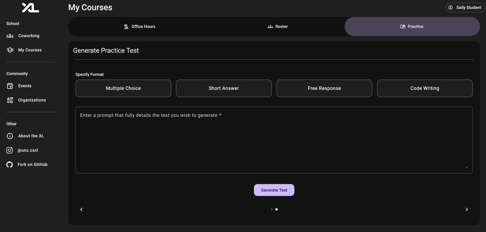

# New Practice Test Generation Component (Team E4)
## Authors  
- Hamzah Yousuf – [@hamzahyous](https://github.com/hamzahyous)  
- Hamzah Yousuf – [@ksankar15](https://github.com/ksankar)  
- Arsh Madhani - [@arshm06](https://github.com/arshm06/)
- Siddhant Borkar - [@SiddhantBorkar04](https://github.com/SiddhantBorkar04)

We have created functionality for students and instructors to upload resources and then students can prompt ChatGPT in order for it to create a practice test to help the student study. Below we detail the backend architecture, the frontend design, and how they connected.

## Backend

### API Routes

We have a resources path and a practice_test path for API routes. The resource path allows instructors or students to upload pdf files for chatgpt to consider when making practice tests, and it also has get and delete routes to retrieve and delete resources as necessary. Similarly for the practice_test path there is a post route where the OpenAI API is called to generate the test, and then get and delete routes to retrieve and delete practice tests as necessary. For both of these paths, the creations are stored in a PostgreSQL database that is implemented using SQLAlchemy.

### Pydantic Models

For the resources routes and entity we have one model called Resource, which has an id for the resource, a title for display, and a the file name. Then for the practice test generation route we have an AIRequest model that stores the user prompt, a list of types of questions wanted for the practice test (eg. Multiple Choice, Short Answer, etc.), and a list of uploaded resource files to aid in generating the practice test. Then we have an AIResponse model which is used to save the information in the practice_test SQL entity, and this model stores an id for the test, the user who created the test, the course the test was created for, the user prompt for the OpenAI API, the output of the API, the time the test was created at, and whether the test is instructor approved. There is also a OpenAPIResponse model to store the practice test generated by the OpenAI API as a string. 

### Entities

The resources and practice_test routes each have their own SQL entity to store new entries made my the post routes. The resource_entity stores the resource id, the title, the file name, the file data, the course id, and the course. The practice_test entity stores the resource id, the user who created the test, the course the test was made for, the user prompt for the API, the contents of the test, the time the test was created at, and whether the practice test is instructor approved.


## Frontend

### Overview
When designing the frontend the main goal was keeping a smooth and engaging flow so any user can upload their own relevant study resources, and then select from their uploads as well as TA uploaded resources. The goal is to allow for a high degree of customization, providing resources, test format options, as well as a user prompt so the user could specify any additional relevant details like what topics to stress spesifically, further structure customization and more.

### UI/UX Structure
Our feature was embedded within the "My Courses" view, spesifically as a third tab built on top of the existing functionality that existed for "Office Hours" and "Roster". This added tab is called "Practice". So upon selecting "Get Help" for a course and specifying the practice page, the user is presented with a landing page. Here, the user is given a couple of options, either the "Generate Test" component, or the "Upload" component.


The frontend for our practice test generation feature is located within the `app/my-courses/course/practice/` directory. Each folder contains the relevant `.ts`, `.html`, and `.css` files as needed to support Angular component logic, layout, and styling. The main and first user story we implemented was `generate-test` and the second was `upload`, with their design structure shown below.

```text
app/
└── my-courses/
    └── course/
        └── practice/
            ├── generate-test/    
                └── input/
                └── selection/
                └── result/
            ├── upload/
            └── widgets/
                └── practice-card/

```
### Component Breakdown

- `practice/` - Main landing page for our implemented features. Uses custom widget for cards that display options like Generate Test and Upload.
- `practice/generate-test/` - A shell with the purpose of holding selection, input and result components. Allows for more modular implementation of generation logic. 
- `practice/generate-test/selection/` – Displays a scrollable list of available course resources (both uploaded and TA-provided) for the user to select from.
- `practice/generate-test/input/` – Allows the user to specify the test format (e.g. multiple choice) and enter a custom prompt.
- `practice/generate-test/result/` – Shows a PDF preview of the generated test and provides a button to download the file.
- `practice/upload/` – Enables users to upload PDF resources to associate with a course. Uploads are stored in the database and shown during selection.
- `practice/widgets/practice-card/` – A reusable card component used on the landing page to represent “Generate Test” and “Upload” actions.


### Frontend Services

We created two frontend service files that manage form state and API interaction for our practice test generation and resource upload features.

- `PracticeTestService`
This service is responsible for handling API Calls made for practice tests. It contains methods that send the user prompt, selected formats and Resource IDs to the backend, generating a customized test with these parameters. The POST request is designed to match the `AIRequest` model. It also handles fetching test results and sends a get request to download the binary test content as a pdf. 

- `PracticeTestFormService`  
  This service is responsbile for handling the reactive form state used across multiple steps of the test generation flow (e.g., prompt input, format selection, resource selection). It allows for the form to exist across numerous components and contains methods that help with resetting the form and certain toggle functionality. This allows components like `input/` and `selection/` to together update the same underlying form data, building an Angular form that matches the `AIRequest` setup.

- `ResourceService`
This service is responsible for managing frontend interactions related to services. It also has methods corresponding to user actions taken on the front end, including `deleteResource`, `downloadResource`, and `getResource`. Each of these sends a corresponding request to our backend routes that handle the request. 

- `UploadResourceService`
This service handles new course resources uploaded by the user. It takes the uploaded file, inputted title, file name, and corresponding test ID, constructing a FormData payload which is then sent to the backend in a POST request. Since it is a lightweight form with little data, we opted not to use Angular’s FormBuilder, but future more detailed resource upload implementations can be easily modified to include that. The fields from this populate a new `ResourceEntity` in the backend, which is stored to be used in test generating.

### User Stories with Images

Below we include images detailing the navigation for both User Stories detailed prior.


This is the selection component for the main user story, test generation. You can select from resources to include in your test to be generated. Resources with verification tick mark and uploaded by TAs and cannot be deleted by students. These resources are included as part of a payload with their `resource_id.` 


This was the component that followed the selection step. Here, you can detail what test formats you want your exam to follow, as well as a prompt input box to detail any further parameters for your exam. This will all be sent as a payload to the backend `AIRequest` model. 


This is the main landing page for our project. It contains both of the user stories we have implemented.


This is the upload page for our project. It involves uploading a file via clicking within the big gray box, or using the choose file button as a fallback. Along with that, the user enters a title for the backend to save the file to the database under. The resource is also given an id that is autoincremented. It also corresponds to the course the user is in which is also a piece of information that is saved to the backend database.